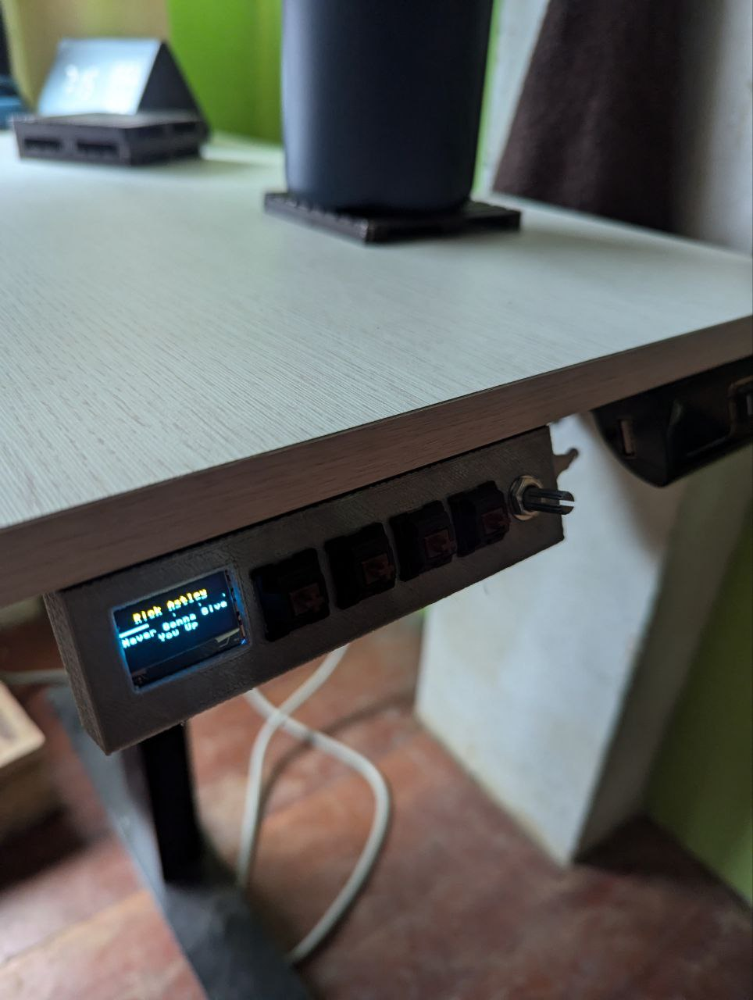

# spotify-keypad-controller
> Forked from https://github.com/vergoh/micropython-spotify-status-display

MicroPython implementation for ESP32 using a small OLED display to show the "currently playing" information of a Spotify playback device. The display, buttons, or the potentiometer can be added as per your preference. For intended usability, having the buttons is highly recommended.

## Features

- "currently playing" information with progress bar
  - artist + track
  - show/podcast + episode
- playback control (optional)
  - previous track 
  - play / pause
  - next track
  - pause after current track
  - add current track to library
  - switch device playing
- configurable poll interval and behavior
- access token stored in the device after initial login
- buzzer (optional) for confirming button presses
- screensaver for standby mode
- self-contained implementation
- [custom 3D printable case](stl/case.stl) or custimze the model in [Thinkercad](https://www.tinkercad.com/things/2gLBOgj0QfW-spomacropad)

## Requirements

- ESP32 with [MicroPython](https://micropython.org/) 1.14 or later
  - version 1.18 or later recommended
  - (I had problems with version 1.22, but 1.21 works fine)
- SSD1306, SSD1309, or SSD1315 compatible 128x64 pixel OLED display in I2C mode
  - [0.96" SSD1306](https://www.google.com/search?q=128x64+oled+i2c+0.96+ssd1306)
  - [0.96" SSD1315](https://www.google.com/search?q=128x64+oled+i2c+0.96+ssd1315) (used in the images)
  - [2.42" SSD1309](https://www.google.com/search?q=128x64+oled+i2c+2.42+ssd1309)
  - most likely okay
    - [1.3" SSD1306](https://www.google.com/search?q=128x64+oled+i2c+1.3+ssd1306)
  - not verified
    - [1.3" SH1106](https://www.google.com/search?q=128x64+oled+i2c+1.3+sh1106)
- [4 Cherry MX switches](https://www.google.com/search?q=cherry%20mx%20switch)
- [4 keycaps](https://www.google.com/search?q=cherry%20mx%20switch%20keycaps)
- 1 10k potentiometer
- WLAN connectivity
- Spotify account
  - Premium needed for playback control
- control buttons (optional)
- buzzer (optional)

See also the beginning of [Case.md](Case.md) for a full list of needed components for building the cased solution shown above.

## Limitations

- buttons don't react during API requests / server communication
- buttons require Spotify Premium due to API restrictions
- default font supports mainly US-ASCII characters
  - unsupported Western characters are, however, automatically mapped to the closest US-ASCII equivalents
- playback device isn't aware of the status display, resulting in delayed status changes when the playback device is directly controlled

## TODO

- better handling of rare cases of `ECONNABORTED` followed by `EHOSTUNREACH` which gets displayed
- async API requests / server communication (if possible)

## Building it

- [3D printed case build](Case.md) or [DIY wiring](Wiring.md) explains the hardware setup
- [Configuration](Configuration.md) contains the install instructions

## Controls

| | active, short press | active, long press | standby | 
| --- | --- | --- | --- |
| previous button | previous track | | | 
| stop button | play / pause / resume | save track | wake up and resume playback | 
| next button | next track | pause after current track | wake up |
| switch button | switch playing to another available device | | |
| potentiometer | volume control (when available) | | |

Long press is >= 500 ms by default.

## Included 3rd party implementations

| file | description |
| --- | --- |
| `ssd1306.py` | based on <https://github.com/adafruit/micropython-adafruit-ssd1306> |
| `uurequests.py` | based on <https://github.com/pfalcon/pycopy-lib/blob/master/uurequests/uurequests.py> |
| `helpers.py` | reduced from <https://github.com/blainegarrett/urequests2> |
