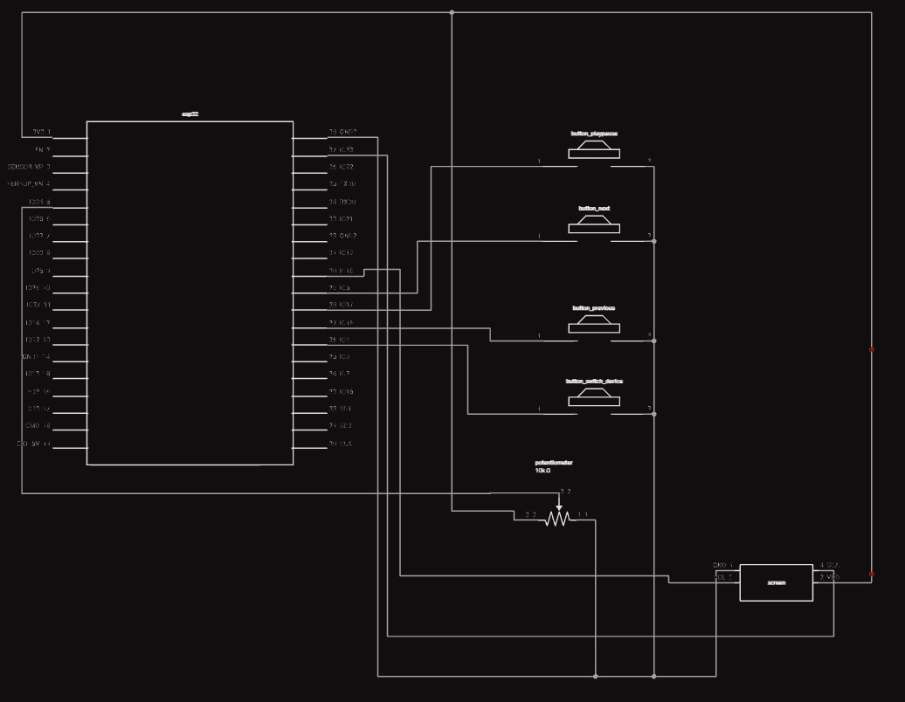

# Wiring

See the live scheme here:
<iframe height="450" width="800" allowfullscreen src="https://www.flux.ai/renatojobal/spostatusopensource?editor=schematic&embed=1" />
https://www.flux.ai/renatojobal/spostatusopensource?editor=schematic
Example connections for "Lolin32 Lite" pins using a SSD1306 based OLED. Pins may vary on other ESP32 boards. For case build, see [Case.md](Case.md).

## SSD1306 OLED

For 0.96" and 1.3" OLEDs using the SSD1306 chip in i2c mode.

| ESP32 | OLED |
| --- | --- |
| 3V3 | VCC |
| GND | GND |
| 23 | SDA |
| 18 | SCK |

## SSD1309 OLED

For 2.42" OLEDs using the SSD1309 chip in i2c mode, use the same wiring as for the SSD1306 OLED shown above. Note that most of these SSD1309 OLEDs require resistors to be moved for enabling the i2c mode. Additionally, a capacitor of around 220-470 μF is needed between ESP32 3V3 and GND in order to avoid brownout during wlan startup when OLED is being active at the same time. This issue can be seen as a "Brownout detector was triggered" console message followed by a forced reset. Also OLED RES needs to be connected to OLED VCC using a 10 kΩ resistor and to GND using a 10-100 μF capacitor:

| OLED | component | OLED |
| --- | --- | ---
| RES | 10 kΩ resistor | VCC |
| RES | 10-100 μF capacitor | GND |

## Buttons

| ESP32 | button | ESP32 |
| --- | --- | --- |
| D4 | left button | GND |
| D5 | right button | GND |

Button pins need to support internal pullups.

## Piezo Buzzer (Optional)

| ESP32 | Buzzer |
| --- | --- |
| 27 | VCC |
| GND | GND |
